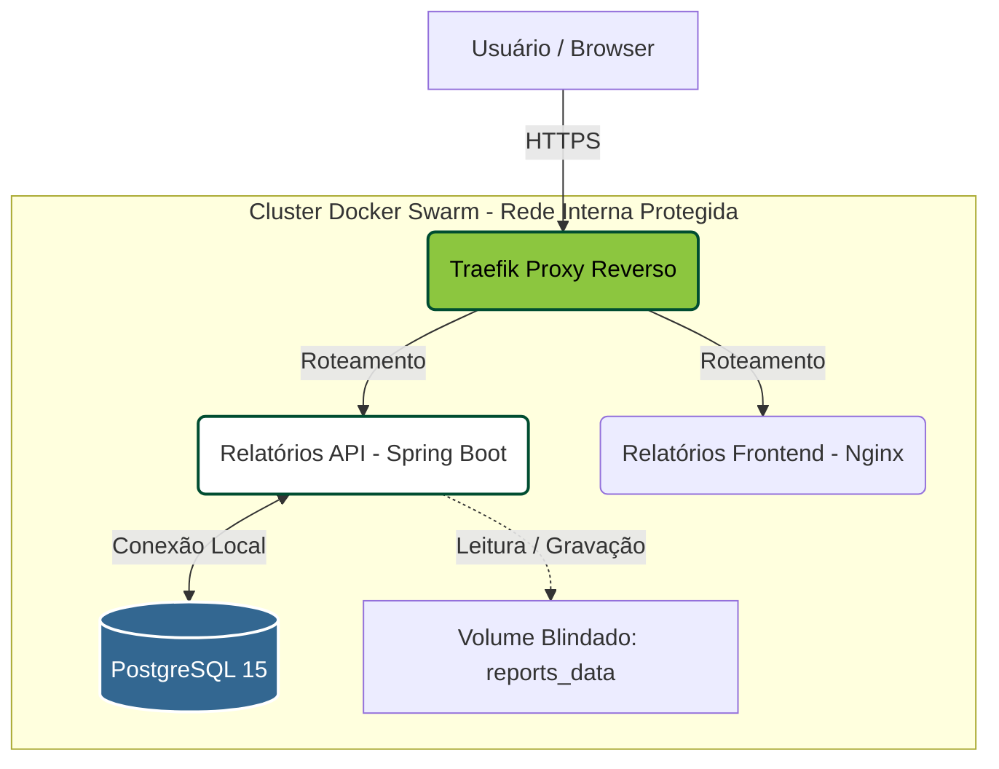
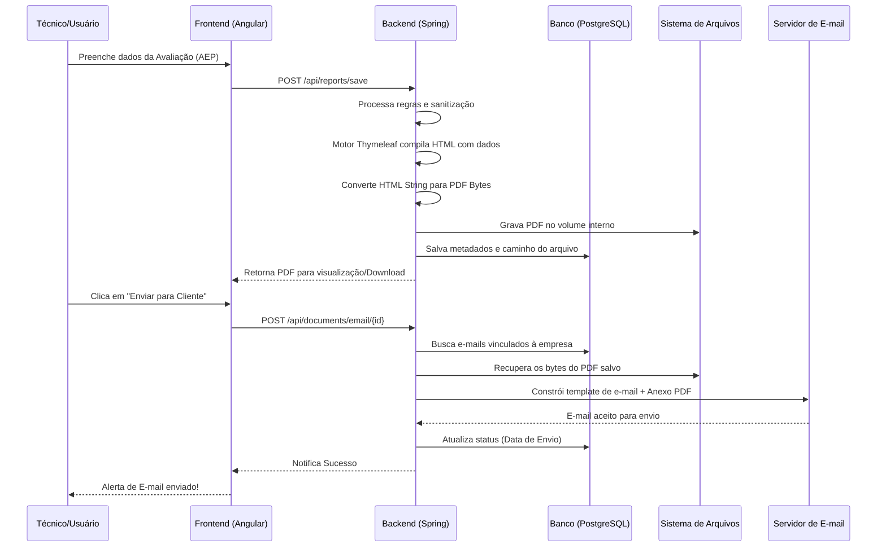

# 📊 Gerenciador de Relatórios (SaaS)

> 🔗 **Acesso ao Sistema:** [relatorios.gotree.site](https://relatorios.gotree.site) *(Acesso restrito a usuários cadastrados)*

**Aviso:** O código-fonte deste repositório é privado por conter regras de negócio e propriedade intelectual. Este documento serve para apresentar a arquitetura, as tecnologias e a engenharia por trás do sistema.

## 🎯 O que é o projeto?
O Gerenciador de Relatórios é uma plataforma completa desenvolvida para automatizar, digitalizar e gerenciar a emissão de laudos técnicos, Avaliações Ergonômicas (AEP), Checklists de Riscos, Visitas Técnicas e o **cronograma de agendamentos** da equipe.

O sistema elimina o uso de planilhas e editores de texto manuais, permitindo a geração de PDFs dinâmicos em tempo real, assinatura digital, disparo automatizado de documentos para os clientes finais e o controle de produtividade dos colaboradores.

## ✨ Principais Funcionalidades
* **Gestão de Agendamentos (Agenda):** Controle completo do cronograma operacional (visitas, treinamentos, etc.), permitindo o acompanhamento do status (realizado/pendente) e a geração de relatórios em PDF com filtros por colaborador, período, tipo de serviço e empresa.
* **Dashboards de Produtividade (BI):** Painel estratégico com indicadores em tempo real, exibindo a carga horária total investida em relatórios de visitas, o volume de documentos emitidos individualmente por usuário e o monitoramento crítico de visitas agendadas e não realizadas.
* **Motor de Geração de PDFs:** Conversão de templates HTML para PDF em tempo real, mantendo a identidade visual corporativa e os dados dinâmicos.
* **Assinatura Digital:** Integração com certificados digitais para validação jurídica dos relatórios gerados pelos técnicos.
* **Disparo Automatizado:** Sistema de e-mail integrado para envio de laudos diretamente aos clientes com um único clique.
* **Gestão Multi-Tenant:** Isolamento estrutural de dados organizados por clientes, filiais/unidades, setores e cargos corporativos.

---

## 🛠️ Stack Tecnológica

O ecossistema foi construído com foco em alta disponibilidade, escalabilidade e segurança.

**Backend & API:**
* Java & Spring Boot (REST API)
* Spring Security & JWT (Autenticação Stateless)
* Spring Data JPA & Hibernate
* Thymeleaf (Template Engine para renderização de relatórios)

**Frontend:**
* Angular & TypeScript
* Design Responsivo e UX focada em agilidade operacional

**Infraestrutura & DevOps (Self-Hosted):**
* Docker & Docker Swarm (Orquestração)
* Traefik (Proxy Reverso dinâmico com auto-discovery)
* Let's Encrypt (SSL/HTTPS automatizado)
* PostgreSQL 15 (Banco de Dados Relacional)
* Shell/Batch Scripting para CI/CD (Zero-downtime deployments)

---

## 🏗️ Arquitetura de Infraestrutura

A aplicação roda em uma VPS isolada, orquestrada via Docker Swarm, garantindo que os contêineres estejam protegidos e o tráfego passe estritamente por um túnel seguro.

## ⚙️ Fluxograma Core: Emissão e Envio de Documentos
Como funciona o coração da aplicação, desde a compilação do relatório até a chegada na caixa de entrada do cliente:

## 🚀 Pipeline de Deploy (CI/CD)
Para manter a agilidade sem depender de serviços externos pesados, foi construída uma rotina de One-Click Deploy.

Um script local conecta-se ao servidor via SCP/SSH (autenticado por chaves RSA), envia os binários compactados (.tar), atualiza as variáveis de ambiente e executa um docker service update --force na stack, garantindo um deploy contínuo sem downtime para o usuário final, seguido de uma rotina automática de Prune para manter o disco otimizado.

## 📸 Telas do Sistema

Desenvolvido com dedicação e foco em excelência técnica por Brena Soares.
